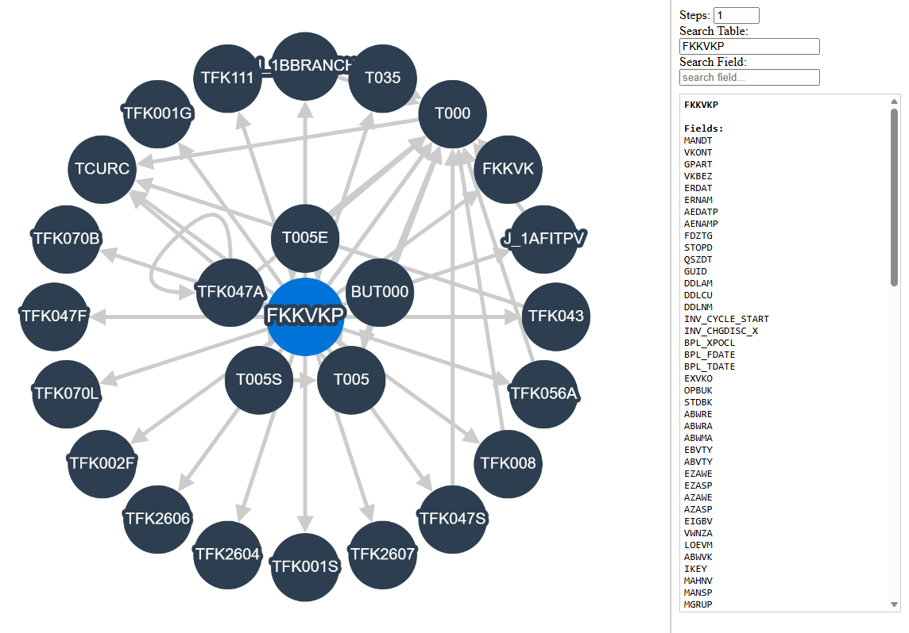
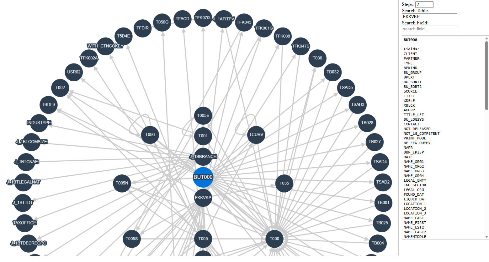
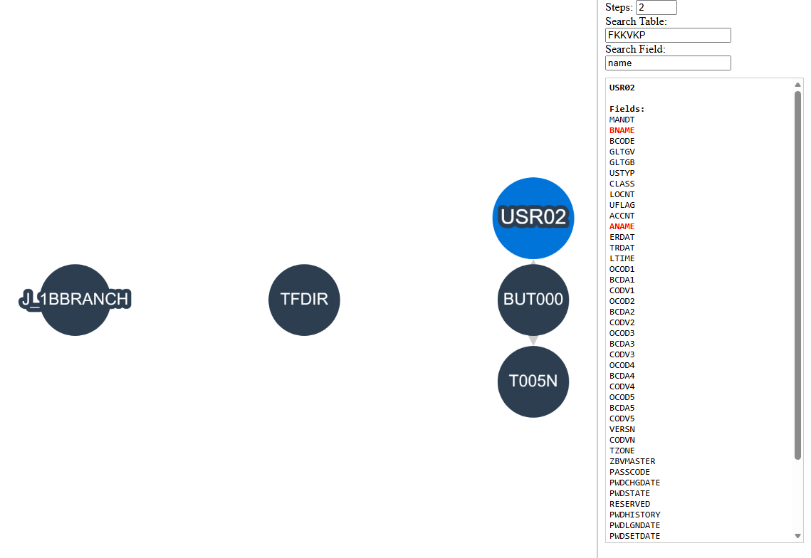

# SAP Table Visualizer

A lightweight interactive tool to visualize **SAP table relationships** and **Foreign Key dependencies** using a force-directed graph.

You can try it live here: [SAP Table Visualizer](https://dolledan.github.io/SAP-Table-Visualizer/)

## Features

- **Dynamic BFS Filtering:** Select a root table (e.g., `FKKVKP`, `MARA`, `BUT000`) and explore its neighbors
- **Dual Search Mode:**
  - **Table Search:** Visualize the network directly around a specific table.
  - **Field Search:** Find every table containing a specific field (e.g., `NAME`) and see how they connect.
- **Interactive Sidebar:** Click any node to see a full list of its fields with live search-term highlighting.
- **High-Performance Rendering:** Uses Cytoscape.js with "Haystack" edges for smooth visualization of hundreds of nodes.

## Use Cases

### 1. Direct Neighbors
Visualize all tables directly linked to a source (e.g., `FKKVKP`) with **1 Step**.

### 2. Multi-Level Analysis
Trace extended relationships by increasing the depth to **2 Steps** from `FKKVKP`.

### 3. Field-Level Discovery
Find all tables within 2 steps of `FKKVKP` that contain a specific field (e.g., **"name"**).

## Built With

- **JavaScript** (Vanilla ES6+)
- **Cytoscape.js** (Graph Theory library)
- **HTML5 & CSS3**

## Data Source

The underlying table metadata is sourced from [leanX.eu](https://leanx.eu).

## Disclaimer

This tool is intended for **educational and development purposes only**. It is not an official SAP product. Data used for visualization should be handled according to your organization's security policies.

## License

This project is licensed under the MIT License.
